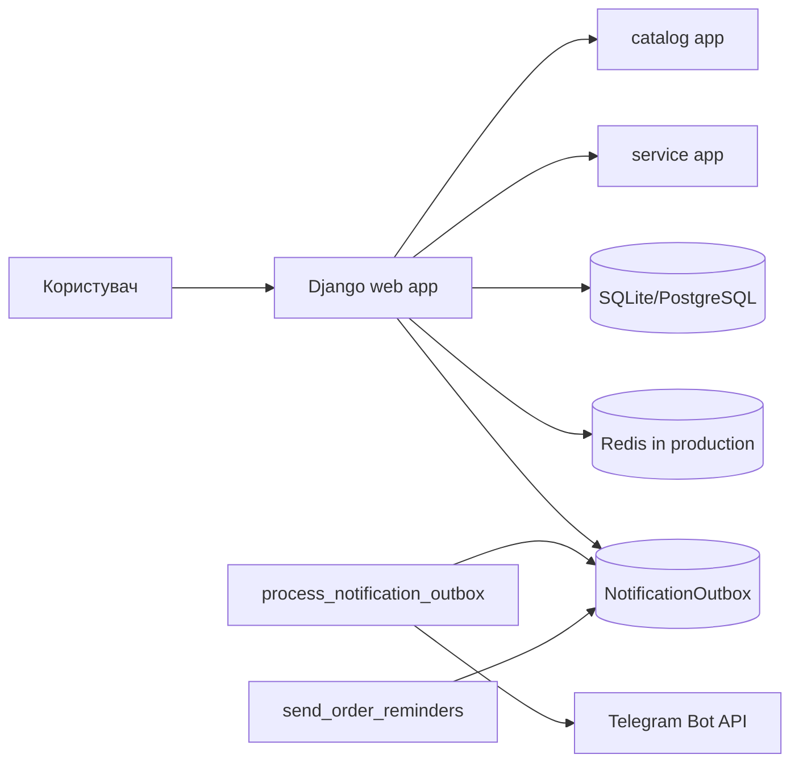

# KS KLIMAT KH

Django-based product catalog and service ordering platform with Telegram notifications, Google OAuth, SEO support, and reliable background delivery.

## Features

- Product catalog with filters, comparison, product detail pages, reviews, ratings, and JSON-LD.
- Conditioner, home, and service order forms.
- Database-backed Telegram notification outbox with retryable delivery.
- Reminder scheduler for unaccepted orders and post-completion service reminders.
- Google OAuth through `django-allauth`.
- Sitemap, robots.txt, canonical metadata, Open Graph, and custom error pages.
- Production-oriented settings validation, Redis-backed rate limiting, WhiteNoise static assets, and health check.

## Technology Stack

- Python 3.11
- Django 5.2
- SQLite for local development
- PostgreSQL for production
- Redis for production rate limiting/cache
- WhiteNoise for static assets
- django-allauth for OAuth
- Ruff, Bandit, pip-audit, coverage

## Architecture



## Local Setup

```powershell
python -m venv venv
.\venv\Scripts\python.exe -m pip install -r requirements-dev.txt
copy .env.example .env
.\venv\Scripts\python.exe manage.py migrate
.\venv\Scripts\python.exe manage.py runserver
```

Local development may use SQLite, local-memory cache, local media, and disabled Telegram.

## Environment Variables

Copy `.env.example` and set values for the target environment. Production must set:

- `DEBUG=False`
- `DJANGO_ENV=production`
- `SECRET_KEY`
- `ALLOWED_HOSTS`
- `SITE_URL=https://...`
- `DB_ENGINE=django.db.backends.postgresql`
- `DB_NAME`, `DB_USER`, `DB_PASSWORD`, `DB_HOST`, `DB_PORT`
- `REDIS_URL`
- `TELEGRAM_BOT_TOKEN`, `TELEGRAM_ADMIN_CHAT_IDS`, `TELEGRAM_WEBHOOK_SECRET` when Telegram is enabled

## Database And Migrations

```powershell
.\venv\Scripts\python.exe manage.py makemigrations --check --dry-run
.\venv\Scripts\python.exe manage.py migrate
```

Existing completed orders are backfilled with `completed_at = updated_at`. Existing duplicate reviews are preserved by marking older rows as `is_superseded=True`, then enforcing one active review per user/product.

## Tests And Quality

```powershell
.\venv\Scripts\python.exe manage.py check
.\venv\Scripts\python.exe manage.py test
.\venv\Scripts\python.exe manage.py collectstatic --noinput
.\venv\Scripts\ruff.exe check .
.\venv\Scripts\ruff.exe format --check .
.\venv\Scripts\bandit.exe -r . -x migrations,venv,staticfiles,media
.\venv\Scripts\pip-audit.exe -r requirements.txt
git diff --check
```

## Operations

- Web process: `gunicorn ks_klimat_kh.wsgi`
- Outbox worker: `python manage.py process_notification_outbox`
- Reminder scheduler: `python manage.py send_order_reminders`
- Static assets: `python manage.py collectstatic --noinput`
- Health check: `/healthz/` checks only the Django web process.

## Deployment Overview

1. Provision PostgreSQL and Redis.
2. Configure production environment variables.
3. Install `requirements.txt`.
4. Run `python manage.py migrate`.
5. Run `python manage.py collectstatic --noinput`.
6. Start the web process.
7. Run `process_notification_outbox` as a worker or scheduled command.
8. Run `send_order_reminders` on a schedule.
9. Configure persistent media/object storage if user uploads must survive deploys.

## Security Notes

- Production fails closed for missing `SECRET_KEY`, empty `ALLOWED_HOSTS`, invalid `SITE_URL`, and missing Redis when rate limiting is enabled.
- Telegram webhook supports `X-Telegram-Bot-Api-Secret-Token` and duplicate `update_id` protection.
- Telegram delivery errors do not block order creation and are retried through the outbox.
- Rate limiting uses authenticated user keys or client IP and only trusts forwarded headers when explicitly enabled.

## SEO

The project provides robots.txt, sitemap.xml, canonical URLs, Open Graph tags, and safe JSON-LD. Product offers are emitted only when price and currency are available. Out-of-stock public products remain indexable with accurate availability metadata unless business requirements change.

## Screenshots

No verified screenshots are committed yet. Repository owner checklist:

- Add catalog screenshot.
- Add product detail screenshot.
- Add service order screenshot.
- Add admin/order workflow screenshot if it contains no personal data.

## Known Trade-Offs

- The outbox worker is intentionally simple and database-backed; Celery is not introduced.
- Local development remains SQLite-based.
- Production media persistence requires external object storage or a persistent disk decision.
- Legacy duplicate reviews are preserved but excluded from active rating/display through `is_superseded`.
